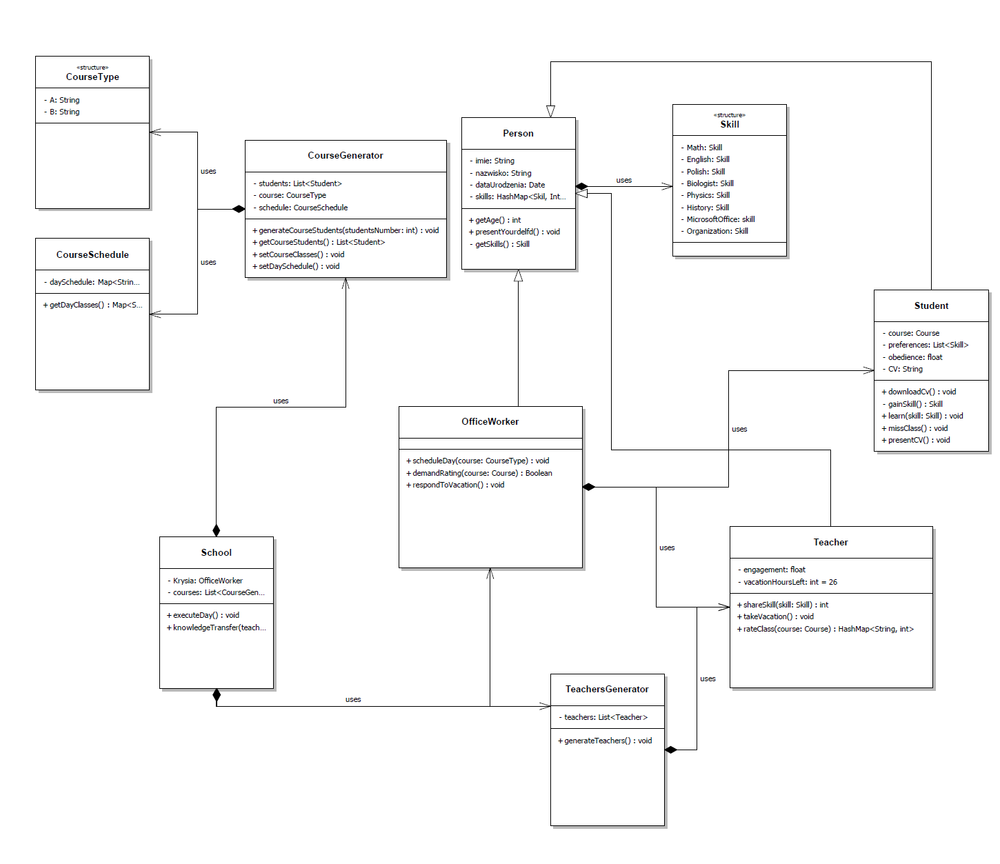

# TestPoz04-HomeWork
**Praca domowa z zajęć "Pigułka"**

Poniższy projekt ma pozwolić na:
1. Wykorzystanie wiedzy z zakresu procesu Continuous Integration (workflow zmiany oraz code review)
2. Praktykę z narzędzia GIT
3. Praktykę programowania obiektowego

Projekt zakłada pracę zespołową - wszyscy pracują na tym samym repozytorium. 
Podział prac ustalany jest pomiędzy kursantami. Każda zmiana przed wprowadzeniem do repozytorium wymaga dwóch review. 
Review wykonywane są przez wszystkich interesariuszy projektu (tj. wszystkich kursantów i przez trenera)

**OPIS PROJEKTU**  
Projekt ma na celu imitować pracę Szkoły - od organizacji zajęć przez administrację, po zajęcia nauczycieli z uczniami.
Projekt "Szkoła" posiada generator kursów (klas), w którym należy również wygenerować uczniów.
W Szkole funkcjonują również nauczyciele, wśród których każdy różni się umiejętnościami i zaangażowaniem wpływającym bezpośrednio na przekaz wiedzy uczniom.
Istnieje również pracownik biurowy, który jako jedyny może tworzyć harmonogramy zajęć.

**PREREQUESITES**  
W projekcie znajduje się plik TestPoz04.ncp, który za pomocą UMLa przedstawia architekturę klas opisanego powyżej projektu.
Aby odtworzyć go w środowisku, w którym został stworzony należy ściagnąć program 
[NCLass](https://sourceforge.net/projects/nclass/) albo skorzystać z poniższego schematu:

  
    
    
**SZCZEGÓŁOWY OPIS PROJEKTU**
* **Klasa School**  
Jest to klasa wykonawcza projektu. Tutaj definiujemy pracownika biurowego oraz nauczycieli. W tej klasie pracownik biurowy
tworzy plan lekcji dla danej klasy uczniów (patrz CourseGenerator). Tutaj wykonujemy dany dzień zajęć (dla wszystkich
zdefiniowanych przez nas wcześniej klas) oraz definiujemy jak wygląda transfer więdzy pomiędzy 
nauczycielem a uczniem (który wykorzystujemy w executeDay)
1. atrybuty: officeWorker, teachers
2. metody: exeuteDay, knowledgeTransfer (patrz wymiana wiedzy)

* **Person**  
Jest to klasa bazowa dla wszystkich innych uzytkowników reprezentujących człowieka. Każdy z osób posiada
specyficzne umiejętności reprezentowane przez strukturę ([enuma](https://www.w3schools.com/java/java_enums.asp))
Skill. 
1. atrybuty: name, lastName, BirthDate, List<Skill>
2. metody: presentYourself, getAge, getSkills

* **OfficeWorker**  
Jest to klasa dziedzicząca po klasie Person i posiadająca w swych umiejętnościach zadeklarowane
wartości umiejętności (Skill) MicrosoftOffice oraz Organization. Każdy OfficeWorker z wysoką umiejętnością 
Organization może stworzyć plan zajęć (scheduleDay) oraz każda z wysoką umiejętnością MicrosoftOffice
może zażądać ocenienia uczniów (demandRating). Oznacza to, że w tych metodach lub w tej klasie powinna być zawarta logika
uniemożliwiająca wykonywania danych zadań przy zbyt niskch Skillach. 
1. metody: scheduleDay, demandRating

* **Skill**  
Struktura skill jest enumem, czyli wyliczeniem. Każdy element enuma reprezentuje kolejne liczby od 0 wzwyż. 
Enum za to pozwala nam odwoływać się do nich po zmiennych zrozumiałych dla człowieka. W enumie nie ma znaczenia reprezentacja liczbowa,
a sam symbol. Na jego podstawie jesteśmy w stanie definiować warunki danych akcji. Umówmy się, że enum Skill (i odpowiednie jego wartości)
reprezentowane są przez system liczbowy z zakresu <0, 10>, gdzie 10 przyznajemy jedynie nauczycielowi 
specjalizującemu się w danym skillu (patrz wymiana wiedzy)

* **Teacher**
Jest to klasa dziedzicząca po klasie Person, która dodatkowo posiada możliwość przekazaniaUmiejętności, 
wzięcia wakacji oraz ocenienia danej klasy (course). posiada dodatkowo atrybuty engagement, wpływający istotnie na 
metode przekazywania wiedzy oraz informacje o możliwych wolnych godzinach. Metoda rateClass powinna zwracać
tablicę, w której do każdego imienia i nazwiska ucznia danego kursu przypisana jest ocena na podstawie skilla, który ocenia 
nauczyciel. ShareSkill z kolei powinno być mnożnikiem zaangażowania nauczyciela oraz ilosć godzin przeprowadzonych.
1. atrybuty: engagement, vacationHoursLeft
2. metody: shareSkill, takeVacation, rateClass

* **TeachersGenerator**  
Klasa ta powinna być użyta tylko raz w School w celu wygenerowania odpowiednich nauczycieli ze zdefiniowanymi skillami,
Math, Polish, English, History itd. W ten sposób powinniśmy być w stanie uzyskać gamę nauczycieli w naszej szkole
atrybuty: List<Teacher> teachers
metody: generateTeachers

* **Student**   
Klasa dziedziczy po klasie person. Poza zdobywaniem umiejętności od nauczyciela ma możliwość
wypisać swoje CV(presentCV) oraz ściągnośc wygenerowane CV do pliku do przyszłych użyć (downloadCV)
Dodatkowo uczeń jest wyposażony w atrybut obedience, który jest silnie powiązany z metodą missClass -
w zależności od tego atrybutu student omija zajęcia. Posiada również atrybut preferences, który definiuje 
listę jego ulubionych umięjtności. Umiejętności z listy przyswaja dwukrotnie szybciej niż wszystkie inne 
(patzr wymiana wiedzy)

***Wymiana wiedzy***  
Główną funkcjonalnością szkoły jest wymiana wiedzy pomiędzy nauczycielem a uczniem. Definicje klas, planu zajęć i inne mają w tym pomóc.
Funkcjonalność ta musi brac pod uwagę zarówno zaangażowanie nauczyciela (a co za tym idzie jego zdolność przekazywania wiedzy),
jak i preferencje ucznia (jego zdolność do wchłaniania wiedzy w danym zakresie). W tej funkcji musi znaleźć się logika wymiany wiedzy pomiędzy
obiektami różnych uczniów i róznych nauczycieli.
 
 